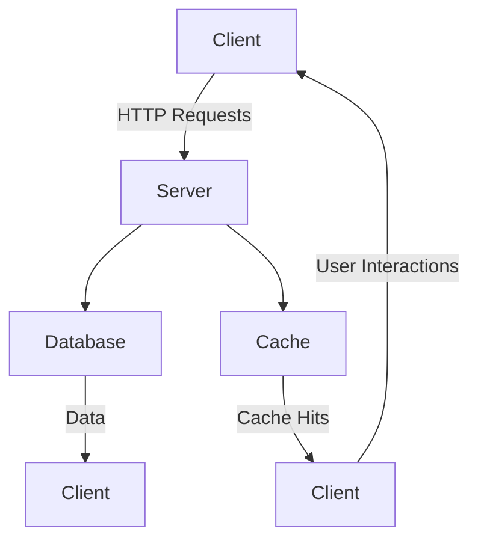

```mermaid
graph TD;
    A[Client] -->|HTTP Requests| B[Server];
    B --> C[Database];
    B --> D[Cache];
    D -->|Cache Hits| E[Client];
    C -->|Data| F[Client];
    E -->|User Interactions| A;
```